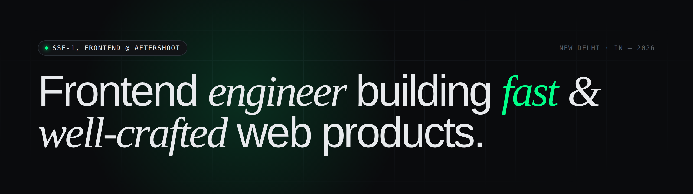

<p align="center">
  
</p>

### Hi, I'm Jatin

5+ years shipping production web apps across fintech, logistics, and media-tech. Currently SSE-1, Frontend at [Aftershoot](https://aftershoot.com) — leading the client gallery product where photographers deliver shoots of 2,000+ images to clients.

**`about.json`**

```json
{
  "name":      "Jatin Assudaney",
  "role":      "SSE-1, Frontend @ Aftershoot",
  "based":     "New Delhi, IN",
  "tz":        "UTC+5:30",
  "shipping":  "since 2020",
  "focus":     ["perf", "media", "DX", "design systems"],
  "available": "open to select freelance projects"
}
```

### Currently

<table>
  <tr>
    <td width="50%" valign="top">
      <h4>At work</h4>
      <p>Image-heavy frontend perf at Aftershoot. Shipped <i>Infinite Gallery</i> (windowed virtualization for 2,000+ image client galleries), an upload pipeline that lifted throughput <b>28%</b> via parallel chunked uploads + backpressure-aware queueing, and fault-tolerant retry with 3× exponential backoff for spotty venue wifi.</p>
    </td>
    <td width="50%" valign="top">
      <h4>On the side</h4>
      <p>Two products in flight:</p>
      <ul>
        <li><b>PingSplit</b> — Splitwise-parity expense tracker with a WhatsApp bot on top, so you split bills inside the chat that's already open.</li>
        <li><b>Flick</b> — storage cleaner built for the Indian smartphone reality. Auto-categorizes WhatsApp media, status saves, memes, and screenshots; swipe-to-trash with a 30-day undo.</li>
      </ul>
    </td>
  </tr>
</table>

### Things I've shipped

<table>
  <tr>
    <td><b>Infinite Gallery</b></td>
    <td><sub>Aftershoot · 2026</sub></td>
    <td>Windowed virtualization + progressive LQIP keeping DOM bounded across 2,000+ image scrolls. <a href="https://jatina.gallery.aftershoot.com/beautiful-gallery">Live ↗</a></td>
  </tr>
  <tr>
    <td><b>Upload Pipeline</b></td>
    <td><sub>Aftershoot · 2026</sub></td>
    <td>Parallel chunked uploads + backpressure queueing for a 28% throughput lift. 3× exponential retry for venue wifi.</td>
  </tr>
  <tr>
    <td><b>Shadow-DOM Platform</b></td>
    <td><sub>Zeta · 2025</sub></td>
    <td>Runtime-federated component platform with SSR host hooks. Self-bundled, version-isolated, drops into Vue 2 or Vue 3 with zero CSS bleed.</td>
  </tr>
  <tr>
    <td><b>DispatchOne</b></td>
    <td><sub>Delhivery · 2023</sub></td>
    <td>Dispatch SaaS + React Native driver app on <a href="https://apps.apple.com/us/app/os1-driver-app/id6449781211">iOS</a> and <a href="https://play.google.com/store/apps/details?id=com.getos1.driver">Android</a>. <a href="https://getos1.com/dispatchone">Live ↗</a></td>
  </tr>
  <tr>
    <td><b>Orca-UI</b></td>
    <td><sub>Delhivery · 2022</sub></td>
    <td>The internal React component library powering Delhivery's products, plus <code>@orca-ui/icons</code> (validate → SVGO → SVGR → publish).</td>
  </tr>
</table>

### Stack

<p align="center">
  <a href="https://skillicons.dev">
    
  </a>
</p>

<p align="center">
  
  
  
  
  
</p>

### Find me

<p>
  <a href="https://jatinassudaney.github.io/"></a>
  <a href="mailto:jatin.assudaney24@gmail.com"></a>
  <a href="https://www.linkedin.com/in/jatin-assudaney"></a>
  <a href="https://leetcode.com/JatinAssudaney"></a>
</p>

---

<p align="center">
  
</p>

<p align="center">
  
</p>
